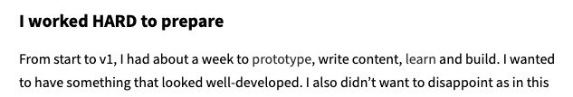
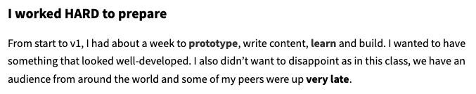

I've been focusing more about UI and UX and I decided to apply some of my knowledge to my website.

The goal was to make basic links more noticeable among text and headers and then make other links really stand out.

As you can see in the image below, links were hard to see (the words "prototype" and "learn" are links).

After some thinking, I wanted regular links to stand out amongst text and I wanted call-to-action type text to really stand out.

I decided on the following styles:

### Default link:

  <a href='#'>This is a default link - hover over me</a>

### Callout link:

  <a href='#' class='brand-link brand-link--callout'>
    This is a callout link - hover over me too
  </a>

Here's the result on the same page:

My callout solution was influenced by the following CodePen: [Pure CSS Link with Rainbow Underline Effect](https://codepen.io/cssparadise/pen/ExxayxM)
